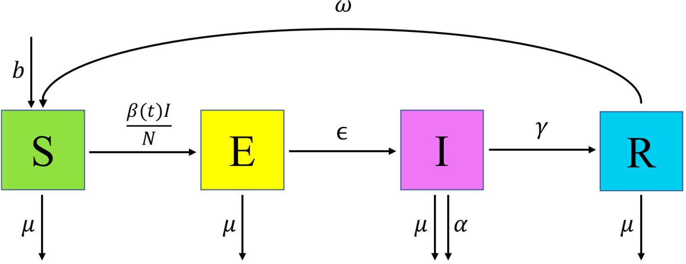

--- 
title: "hmer: customising implausibility"
author: "Danny Scarponi, Andy Iskauskas"
site: bookdown::bookdown_site
output:
    bookdown::pdf_book:
        includes:
            in_header: header.tex
    bookdown::gitbook:
        config:
            sharing: null
        css: 'style.css'
        highlight: tango
        includes:
            in_header: _toggle.html
        keep_md: TRUE
bibliography: references.bib  
linkcolor: blue
documentclass: book
link-citations: yes
description: "A note on how to go customise implausibility to impose restrictions on parameters"
---

```{r, child = "_setup.Rmd", include = F, purl = F, cache = T}
```


```{r setup, include=F}
knitr::opts_chunk$set(echo = TRUE, cache =T)
chosen_params <- list(b = 1/(76*365), mu = 1/(76*365), beta1 = 0.214, beta2 = 0.107, beta3 = 0.428, epsilon = 1/7, alpha = 1/50, gamma = 1/14, omega = 1/365)
library(hmer)
library(deSolve)
library(ggplot2)
library(reshape2)
library(purrr)
library(tidyverse)
library(lhs)
set.seed(123)
ode_results <- function(parms, end_time = 365*2) {
  forcer = matrix(c(0, parms['beta1'], 100, parms['beta2'], 180, parms['beta2'], 270, parms['beta3']), 
                  ncol = 2, byrow = TRUE)
  force_func = approxfun(x = forcer[,1], y = forcer[,2], method = "linear", rule = 2)
  des = function(time, state, parms) {
    with(as.list(c(state, parms)), {
      dS <- b*(S+E+I+R)-force_func(time)*I*S/(S+E+I+R) + omega*R - mu*S
      dE <- force_func(time)*I*S/(S+E+I+R) - epsilon*E - mu*E
      dI <- epsilon*E - alpha*I - gamma*I - mu*I
      dR <- gamma*I - omega*R - mu*R
      return(list(c(dS, dE, dI, dR)))
    })
  }
  yini = c(S = 900, E = 100, I = 0, R = 0)
  times = seq(0, end_time, by = 1)
  out = deSolve::ode(yini, times, des, parms)
  return(out)
}
get_results <- function(params, times, outputs) {
  t_max <- max(times)
  all_res <- ode_results(params, t_max)
  actual_res <- all_res[all_res[,'time'] %in% times, c('time', outputs)]
  shaped <- reshape2::melt(actual_res[,outputs])
  return(setNames(shaped$value, paste0(shaped$Var2, actual_res[,'time'], sep = "")))
}
```

# Objectives
In this note we describe how to define customised implausibility measures when calibrating a model with the hmer package. Customised implausibility measures allow the hmer user to work with parameter spaces that are not necessarily rectangular, for example by imposing restrictions on parameters of the type `parameter_1 < parameter2`.

Before diving into this note, you will need to run the code contained in the box below: it will load all relevant dependencies and a few helper functions which will be introduced and used later.   

```{info, title="Code to load relevant libraries and helper functions"}

``{r, eval=F}
library(hmer)
library(deSolve)
library(ggplot2)
library(reshape2)
library(purrr)
library(tidyverse)
library(lhs)
set.seed(123)
############################# HELPER FUNCTIONS #############################
# `ode_results` provides us with the solution of the differential equations for a given 
# set of parameters. This function assumes an initial population of 
# 900 susceptible individuals, 100 exposed individuals, and no infectious 
# or recovered individuals.
ode_results <- function(parms, end_time = 365*2) {
  forcer = matrix(c(0, parms['beta1'], 100, parms['beta2'], 180, parms['beta2'], 270, parms['beta3']), 
                  ncol = 2, byrow = TRUE)
  force_func = approxfun(x = forcer[,1], y = forcer[,2], method = "linear", rule = 2)
  des = function(time, state, parms) {
    with(as.list(c(state, parms)), {
      dS <- b*(S+E+I+R)-force_func(time)*I*S/(S+E+I+R) + omega*R - mu*S
      dE <- force_func(time)*I*S/(S+E+I+R) - epsilon*E - mu*E
      dI <- epsilon*E - alpha*I - gamma*I - mu*I
      dR <- gamma*I - omega*R - mu*R
      return(list(c(dS, dE, dI, dR)))
    })
  }
  yini = c(S = 900, E = 100, I = 0, R = 0)
  times = seq(0, end_time, by = 1)
  out = deSolve::ode(yini, times, des, parms)
  return(out)
}
# `get_results` acts as `ode_results`, but has the additional feature 
# of allowing us to decide which outputs and times should be returned. 
# For example, to obtain the number of infected and susceptible individuals 
# at t=25 and t=50, we would set `times=c(25,50)` and `outputs=c('I','S')`.
get_results <- function(params, times, outputs) {
  t_max <- max(times)
  all_res <- ode_results(params, t_max)
  actual_res <- all_res[all_res[,'time'] %in% times, c('time', outputs)]
  shaped <- reshape2::melt(actual_res[,outputs])
  return(setNames(shaped$value, paste0(shaped$Var2, actual_res[,'time'], sep = "")))
}
``

```


# The model and calibration setup{#intro}

In this section we define the model and the calibration setup for our example.

The model that we chose for demonstration purposes is the deterministic  <span class="abbr" title="A model consisting of four compartments 

- $S$: Susceptible individuals,
- $E$: Exposed individuals (i.e. people that are infected but not infectious yet), 
- $I$: Infectious individuals,  
- $R$: Recovered individuals, 

and four possible transitions

- $S \rightarrow E$, when a susceptible individual becomes infected, 
- $E \rightarrow I$, when an infected individual becomes infectious,
- $I \rightarrow R$, when an infectious individual recovers,
- $R \rightarrow S$, when a recovered individual becomes susceptible again.

SEIRS models are used to study those infectious diseases that do not confer permanent immunity."><abbr title="A model consisting of four compartments 

- S: Susceptible individuals,
- E: Exposed individuals (i.e. people that are infected but not infectious yet), 
- I: Infectious individuals,  
- R: Recovered individuals, 

and four possible transitions

- S to E, when a susceptible individual becomes infected, 
- E to I, when an infected individual becomes infectious,
- I to R, when an infectious individual recovers,
- R to S, when a recovered individual becomes susceptible again.

SEIRS models are suitable to study those infectious diseases that have an incubation period and do not confer permanent immunity.">
SEIRS</abbr></span>
model used in the [deterministic workshop](https://danny-sc.github.io/determ_workshop/index.html) and is described by the following differential equations:
\begin{align}
\frac{dS}{dt} &= b N - \frac{\beta(t)IS}{N} + \omega R -\mu S  \\ 
\frac{dE}{dt} &= \frac{\beta(t)IS}{N} - \epsilon E - \mu E \\ 
\frac{dI}{dt} &= \epsilon E - \gamma I - (\mu + \alpha) I \\ 
\frac{dR}{dt} &= \gamma I - \omega R - \mu R
\end{align}
where $N$ is the total population, varying over time, and the parameters are as follows:

- $b$ is the birth rate, 

- $\mu$ is the  rate of death from other causes, 

- $\beta(t)$ is the infection rate between each infectious and susceptible individual, 

- $\epsilon$ is the rate of becoming infectious after infection, 

- $\alpha$ is the rate of death from the disease, 

- $\gamma$ is the recovery rate and  

- $\omega$ is the rate at which immunity is lost following recovery. 

``` {r, echo = FALSE, fig.cap='SEIRS Diagram'}

```

The rate of infection $\beta(t)$ is set to be a simple linear function interpolating between points, where the points in question are $\beta(0)=\beta_1$, $\beta(100) = \beta(180) = \beta_2$, $\beta(270) = \beta_3$ and where $\beta_2 < \beta_1 < \beta_3$. This choice was made to represent an infection rate that initially drops due to external (social) measures and then raises when a more infectious variant appears. Here $t$ is taken to measure days. Below we show a graph of the infection rate over time when $\beta_1=0.3, \beta_2=0.1$ and $\beta_3=0.4$:

``` {r, echo = FALSE, fig.cap='Infection rate graph', out.width="60%"}
knitr::include_graphics('infection_rate.png')
```

We now set up the emulation task, defining the input parameter ranges, the calibration targets and all the data necessary to build the first wave of emulators.

First of all, let us set the parameter ranges:

```{r}
ranges = list(
  b = c(1e-5, 1e-4), # birth rate
  mu = c(1e-5, 1e-4), # rate of death from other causes
  beta1 = c(0.1, 0.5), # infection rate at time t=0
  beta2 = c(0.1, 0.5), # infection rates at time t=100
  beta3 = c(0.1, 0.5), # infection rates at time t=270
  epsilon = c(0.07, 0.21), # rate of becoming infectious after infection
  alpha = c(0.01, 0.025), # rate of death from the disease
  gamma = c(0.05, 0.08), # recovery rate
  omega = c(0.002, 0.004) # rate at which immunity is lost following recovery
)
```

**Note that, even though $\beta_1$, $\beta_2$ and $\beta_3$ have the same initial range $[0.1,0.5]$, when calibrating the model we want to impose $\beta_2<\beta_1<\beta_3$.**

We then turn to the targets we will match: the number of infectious individuals $I$ and the number of recovered individuals $R$ at times $t=25, 40, 100, 200, 200, 350$:

```{r}
targets <- list(
  I25 = list(val = 115.88, sigma = 5.79),
  I40 = list(val = 137.84, sigma = 6.89),
  I100 = list(val = 26.34, sigma = 1.317),
  I200 = list(val = 0.68, sigma = 0.034),
  I300 = list(val = 29.55, sigma = 1.48),
  I350 = list(val = 68.89, sigma = 3.44),
  R25 = list(val = 125.12, sigma = 6.26),
  R40 = list(val = 256.80, sigma = 12.84),
  R100 = list(val = 538.99, sigma = 26.95),
  R200 = list(val = 444.23, sigma = 22.21),
  R300 = list(val = 371.08, sigma = 15.85),
  R350 = list(val = 549.42, sigma = 27.47)
)
``` 
  
Finally we need an initial design `wave0`, containing a well-spread set of parameter sets and the corresponding model outputs:

```{r}
initial_LHS_training <- maximinLHS(90, 9)
initial_LHS_validation <- maximinLHS(90, 9)
initial_LHS <- rbind(initial_LHS_training, initial_LHS_validation)
initial_points <- setNames(data.frame(t(apply(initial_LHS, 1, 
                  function(x) x*unlist(lapply(ranges, function(x) x[2]-x[1])) + 
                  unlist(lapply(ranges, function(x) x[1]))))), names(ranges))
initial_results <- setNames(data.frame(t(apply(initial_points, 1, get_results, 
                   c(25, 40, 100, 200, 300, 350), c('I', 'R')))), names(targets))
wave0 <- cbind(initial_points, initial_results)
```

# First wave emulators {#constr}

In this section we train the first wave of emulators.

Let us start by splitting `wave0` in two parts: the training set (the first half), on which we will train the emulators, and a validation set (the second half), which will be used to do diagnostics of the emulators. 

```{r}
training <- wave0[1:90,]
validation <- wave0[91:180,]
```

We are now ready to train the emulators using the `emulator_from_data` function. 

```{r}
ems_wave1 <- emulator_from_data(training, names(targets), ranges)
```

# Proposing new points with custom implausibility

In this section we generate the set of points that will be used to train the second wave of emulators. **To ensure that the relationship $\beta_2<\beta_1<\beta_3$ is satisfied, we define a customised version of the implausibility measure.**

```{r fig.width = 9, fig.height = 9}
custom_imp <- function(ems, points, targets, cutoff, n, ...) {
  # Work out which points pass our restrictions beta2 < beta1 < beta3
  simple_pass <- which(points$beta2 < points$beta1 &
                       points$beta1 < points$beta3) 
  # Set up an output vector
  output <- rep(FALSE, nrow(points)) 
  # In case all the points fail these cases return the output with all entries equal to FALSE
  if (length(simple_pass) == 0) return(output)
  # Otherwise, put the implausibility values in for the points that passed the earlier checks
  output[simple_pass] <- nth_implausible(ems, points[simple_pass,], targets, 
                                         n = n, cutoff = cutoff, ...) 
  return(output)
}
```

The `custom_imp` function returns the standard implausibility measure (see [deterministic workshop](https://danny-sc.github.io/determ_workshop/index.html)) for parameter sets that satisfy the condition $\beta_2<\beta_1<\beta_3$, and it returns FALSE otherwise.

To use this customised implausibility when calling the `generate_new_design` function, we simply need to set `opts=list(accept_measure = custom_imp)`:

```{r}
new_points <- generate_new_design(ems_wave1, 180, targets, verbose=TRUE, 
                                opts=list(accept_measure = custom_imp))
```

Let us check the values of the three beta parameters for the newly generated parameter sets:

```{r, fig.width = 6, fig.height = 6}
ggplot(new_points, aes(x = beta1, y = beta2)) + geom_point() + 
       xlim(0.1,0.5) + ylim(0.1,0.5) +
       geom_abline(intercept = 0, slope = 1, color="red", linetype="dashed", linewidth=1.5) + 
       theme_bw()
ggplot(new_points, aes(x = beta1, y = beta3)) + geom_point() + 
       xlim(0.1,0.5) + ylim(0.1,0.5) +
       geom_abline(intercept = 0, slope = 1, color="red", linetype="dashed", linewidth=1.5) +
       theme_bw()
```

The plots clearly show that all non-implausible parameter sets at the end of the first wave satisfy the inequalities $\beta_2<\beta_1<\beta_3$, which is what we wanted. 

From here, the history matching process continues as usual (see [deterministic workshop](https://danny-sc.github.io/determ_workshop/index.html)), with the only difference being that whenever the `generate_new_design` is called, the argument `opts` needs to be set to `list(accept_measure = custom_imp)`.
